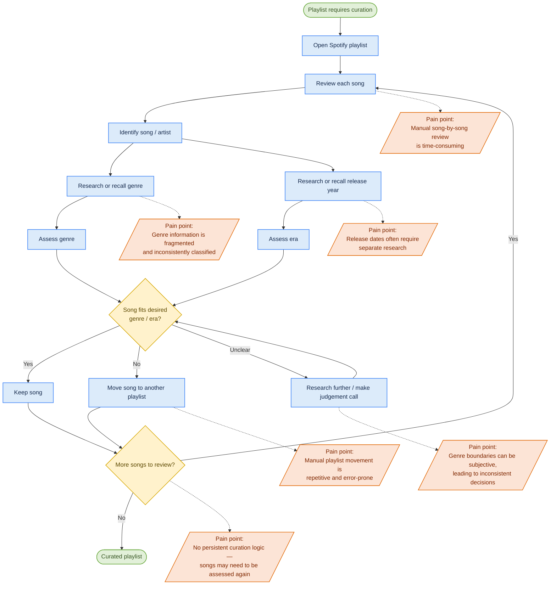

```mermaid
flowchart TD
    A([Playlist requires curation])

    B[Open Spotify playlist]
    C[Review each song]
    D[Identify song / artist]

    E[Research or recall genre]
    F[Research or recall release year]

    G[Assess genre]
    H[Assess era]

    I{Song fits desired<br/>genre / era?}

    J[Keep song]
    K[Move song to another playlist]
    L[Research further / make judgement call]

    M{More songs to review?}

    N([Curated playlist])

    P1[/Pain point:<br/>Manual song-by-song review<br/>is time-consuming/]
    P2[/Pain point:<br/>Genre information is fragmented<br/>and inconsistently classified/]
    P3[/Pain point:<br/>Release dates often require<br/>separate research/]
    P4[/Pain point:<br/>Genre boundaries can be subjective,<br/>leading to inconsistent decisions/]
    P5[/Pain point:<br/>Manual playlist movement is<br/>repetitive and error-prone/]
    P6[/Pain point:<br/>No persistent curation logic —<br/>songs may need to be assessed again/]

    A --> B
    B --> C
    C --> D

    D --> E
    D --> F

    E --> G
    F --> H

    G --> I
    H --> I

    I -->|Yes| J
    I -->|No| K
    I -->|Unclear| L

    L --> I

    J --> M
    K --> M

    M -->|Yes| C
    M -->|No| N

    C -.-> P1
    E -.-> P2
    F -.-> P3
    L -.-> P4
    K -.-> P5
    M -.-> P6

    classDef process fill:#DCEBFA,stroke:#3B82F6,stroke-width:1.5px,color:#172B4D
    classDef decision fill:#FFF2CC,stroke:#D6A700,stroke-width:1.5px,color:#5C4800
    classDef pain fill:#FCE4D6,stroke:#E26B0A,stroke-width:1.5px,color:#7F2700
    classDef startend fill:#E2F0D9,stroke:#70AD47,stroke-width:1.5px,color:#375623

    class B,C,D,E,F,G,H,J,K,L process
    class I,M decision
    class P1,P2,P3,P4,P5,P6 pain
    class A,N startend
```