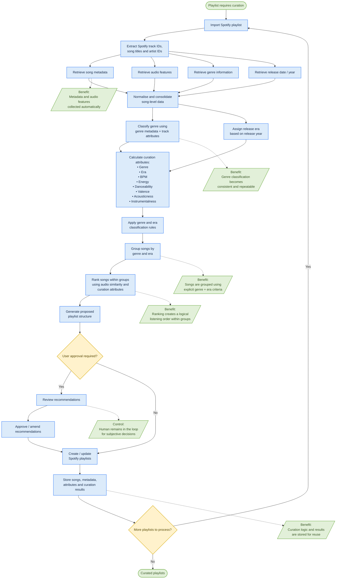

```mermaid
flowchart TD
    A([Playlist requires curation])

    B[Import Spotify playlist]
    C[Extract Spotify track IDs,<br/>song titles and artist IDs]

    D[Retrieve song metadata]
    E[Retrieve audio features]
    F[Retrieve genre information]
    G[Retrieve release date / year]

    H[Normalise and consolidate<br/>song-level data]

    I[Classify genre using<br/>genre metadata + track attributes]
    
    J[Assign release era<br/>based on release year]

    K[Calculate curation attributes:<br/>• Genre<br/>• Era<br/>• BPM<br/>• Energy<br/>• Danceability<br/>• Valence<br/>• Acousticness<br/>• Instrumentalness]

    L[Apply genre and era<br/>classification rules]

    M[Group songs by<br/>genre and era]

    N[Rank songs within groups<br/>using audio similarity and<br/>curation attributes]

    O[Generate proposed<br/>playlist structure]

    P{User approval required?}

    Q[Review recommendations]
    R[Approve / amend recommendations]

    S[Create / update<br/>Spotify playlists]
    T[Store songs, metadata,<br/>attributes and curation results]

    U{More playlists to process?}

    V([Curated playlists])

    P1[/Benefit:<br/>Metadata and audio features<br/>collected automatically/]
    P2[/Benefit:<br/>Genre classification becomes<br/>consistent and repeatable/]
    P3[/Benefit:<br/>Songs are grouped using<br/>explicit genre + era criteria/]
    P4[/Benefit:<br/>Ranking creates a logical<br/>listening order within groups/]
    P5[/Control:<br/>Human remains in the loop<br/>for subjective decisions/]
    P6[/Benefit:<br/>Curation logic and results<br/>are stored for reuse/]

    A --> B
    B --> C

    C --> D
    C --> E
    C --> F
    C --> G

    D --> H
    E --> H
    F --> H
    G --> H

    H --> I
    H --> J

    I --> K
    J --> K

    K --> L
    L --> M
    M --> N
    N --> O

    O --> P

    P -->|Yes| Q
    Q --> R
    R --> S

    P -->|No| S

    S --> T
    T --> U

    U -->|Yes| B
    U -->|No| V

    D -.-> P1
    I -.-> P2
    M -.-> P3
    N -.-> P4
    Q -.-> P5
    T -.-> P6

    classDef process fill:#DCEBFA,stroke:#3B82F6,stroke-width:1.5px,color:#172B4D
    classDef decision fill:#FFF2CC,stroke:#D6A700,stroke-width:1.5px,color:#5C4800
    classDef benefit fill:#E2F0D9,stroke:#70AD47,stroke-width:1.5px,color:#375623
    classDef startend fill:#E2F0D9,stroke:#70AD47,stroke-width:1.5px,color:#375623

    class B,C,D,E,F,G,H,I,J,K,L,M,N,O,Q,R,S,T process
    class P,U decision
    class P1,P2,P3,P4,P5,P6 benefit
    class A,V startend
```