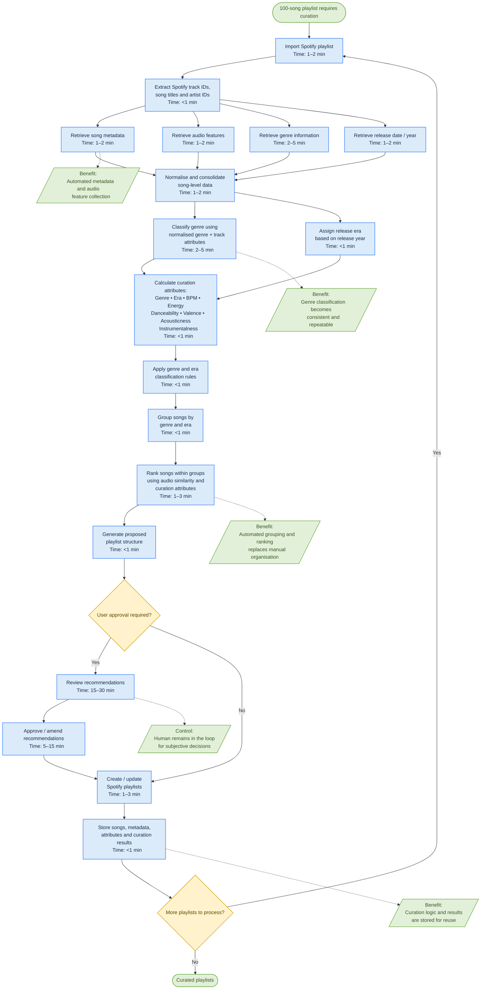

```mermaid
flowchart TD
    A([100-song playlist requires curation])

    B[Import Spotify playlist
    Time: 1–2 min]

    C[Extract Spotify track IDs,
    song titles and artist IDs
    Time: <1 min]

    D[Retrieve song metadata
    Time: 1–2 min]

    E[Retrieve audio features
    Time: 1–2 min]

    F[Retrieve genre information
    Time: 2–5 min]

    G[Retrieve release date / year
    Time: 1–2 min]

    H[Normalise and consolidate
    song-level data
    Time: 1–2 min]

    I[Classify genre using
    normalised genre + track attributes
    Time: 2–5 min]

    J[Assign release era
    based on release year
    Time: <1 min]

    K[Calculate curation attributes:
    Genre • Era • BPM • Energy
    Danceability • Valence • Acousticness
    Instrumentalness
    Time: <1 min]

    L[Apply genre and era
    classification rules
    Time: <1 min]

    M[Group songs by
    genre and era
    Time: <1 min]

    N[Rank songs within groups
    using audio similarity and
    curation attributes
    Time: 1–3 min]

    O[Generate proposed
    playlist structure
    Time: <1 min]

    P{User approval required?}

    Q[Review recommendations
    Time: 15–30 min]

    R[Approve / amend recommendations
    Time: 5–15 min]

    S[Create / update
    Spotify playlists
    Time: 1–3 min]

    T[Store songs, metadata,
    attributes and curation results
    Time: <1 min]

    U{More playlists to process?}

    V([Curated playlists])

    P1[/Benefit:
    Automated metadata and audio
    feature collection/]

    P2[/Benefit:
    Genre classification becomes
    consistent and repeatable/]

    P3[/Benefit:
    Automated grouping and ranking
    replaces manual organisation/]

    P4[/Control:
    Human remains in the loop
    for subjective decisions/]

    P5[/Benefit:
    Curation logic and results
    are stored for reuse/]

    A --> B
    B --> C

    C --> D
    C --> E
    C --> F
    C --> G

    D --> H
    E --> H
    F --> H
    G --> H

    H --> I
    H --> J

    I --> K
    J --> K

    K --> L
    L --> M
    M --> N
    N --> O

    O --> P

    P -->|Yes| Q
    Q --> R
    R --> S

    P -->|No| S

    S --> T
    T --> U

    U -->|Yes| B
    U -->|No| V

    D -.-> P1
    I -.-> P2
    N -.-> P3
    Q -.-> P4
    T -.-> P5

    classDef process fill:#DCEBFA,stroke:#3B82F6,stroke-width:1.5px,color:#172B4D
    classDef decision fill:#FFF2CC,stroke:#D6A700,stroke-width:1.5px,color:#5C4800
    classDef benefit fill:#E2F0D9,stroke:#70AD47,stroke-width:1.5px,color:#375623
    classDef startend fill:#E2F0D9,stroke:#70AD47,stroke-width:1.5px,color:#375623

    class B,C,D,E,F,G,H,I,J,K,L,M,N,O,Q,R,S,T process
    class P,U decision
    class P1,P2,P3,P4,P5 benefit
    class A,V startend
```